% Spark
% T. Verbeiren
% 9/7/2014


# Contents

Introduction

Spark

Not covered

Ecosystem

Example(s)

- - -

# Me, Myself and I

- - -

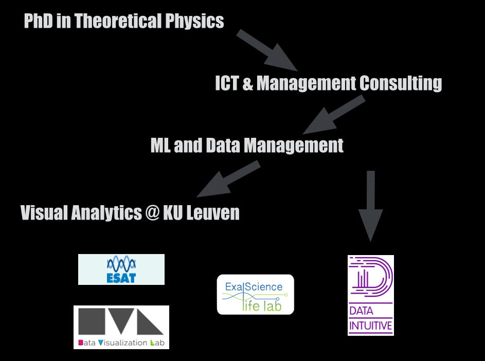

- - -

# Introduction

- - -

## Distribution is hard ...

- - - 

## Map / Reduce

\ 

### Mapper

\ 

### Reducer

\ 

(Nothing special!)

- - -

## Word Count in M/R

- - -

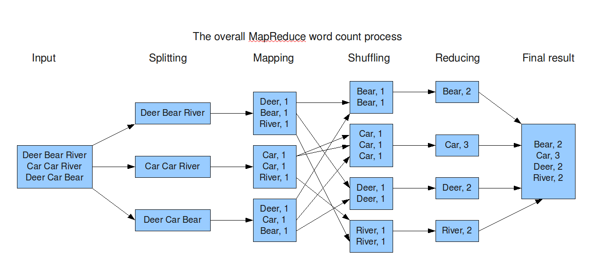

- - -

## What if ...

- - - 

### ... we could just write

\ 

```scala
val y = x map () reduce ()
```

- - -

### ... this could be extended

\ 

```scala
val y = x map () filter() map () flatMap () reduce ()
```

- - -

## What would be needed?

\ 

1. Platform

<!-- Fast and efficient resource management -->

\ 

2. Parallel abstraction mechanism

<!-- Some kind of abstraction that allows us to deal with what instead of how -->

\ 

3. Language support

<!-- Functions as first-class citizens -->

\ 


- - -

# Spark

- - -

- Berkeley University
- Apache Project
- v1.0 released on May 30d 2014
- Written in Scala
- Supported by [DataBricks](http://databricks.com/)
- Used by ...

\ 


- - -

## Language support

\


- - -

## Platform

\ 

Built for low-latency

- - -

## Abststraction mechanism

\ 

**R**esilient **D**istributed **D**atasets

- - -

### RDDs

\ 

*Immutable* Collection

\ 

Accepting **transformations** and **actions**

- - -

### Transformations

\ 

- `map`
- `filter`
- `sample`
- `union` / `intersection`
- `groupByKey`
- `reduceByKey`
- `join`
- ...

- - -

### Actions

\ 

- `reduce`
- `collect`
- `count`
- `take(n)`
- `saveAsTextFile`
- ...

- - -

<svg width="400" height="400">
  <rect width="400" height="400" style="fill:rgb(0,0,0);stroke-width:0;stroke:rgb(0,0,0)" />
  <circle cx="200" cy="200" r="200" stroke="black" stroke-width="0" fill="yellow" />
  <line x1="200" y1="200" x2="360" y2="80" style="stroke:rgb(0,0,0);stroke-width:4" />
  <text x="280" y="80" fill="black">r = 1/2</text>
</svg>

\ 

$$\text{P}(\text{hitting circle}) \approx
\text{Surface circle} = \frac{\pi}{4}$$

- - -

```scala
import sc._

val N = 10000000

// Generate a sequence of numbers and distribute
val par = parallelize(1 to N)
// par: org.apache.spark.rdd.RDD[Int] = ParallelCollectionRDD[1] 
//   at parallelize at <console>:12
```

- - -

```scala
// Generate a point in 2D unit square
def randomPoint:(Double,Double) = {
    val x = Math.random()
    val y = Math.random()
    (x,y)
}
// Check if a point lies in the unit circle
def inCircle(point:(Double,Double)):Int = {
    if (point._1*point._1 + point._2*point._2 < 1) 1 else 0
}
```

- - -

```scala
// List of hits yes/no
val inCircleList = par map(i => inCircle(randomPoint))

// Return the first 5 elements from the RDD
inCircleList take 5

// Get info about the RDD
inCircleList.toDebugString

// The number of hits
val total = inCircleList reduce (_+_)

// Probability of hitting the circle *4 = Pi
val S = 4. * total / N
```

- - -

From the [Spark examples](https://spark.apache.org/examples.html) page

\

```scala
val count = parallelize(1 to N).map{i =>
  val x = Math.random()
  val y = Math.random()
  if (x*x + y*y < 1) 1 else 0
}.reduce(_ + _)
println("Pi is roughly " + 4.0 * count / N)
```

- - -

Hadoop M/R in Spark

\ 

```scala
// Read a file, e.g. Ulysses from Project Gutenberg
// and process it similar to Hadoop M/R
val file = textFile("Joyce-Ulysses.txt")

// Convert to an array of words in the text
val words = file.flatMap(_.split(" "))

// Map to (key,value) pairs
val mapped = words map (word => (word,1)) 

// Sort and group by key, 
// Result is of form (key, List(value1, value2, value3, ...))
val grouped = mapped sortByKey() groupByKey()

// The length of the values array yields the amount
val result = grouped map {case (k,vs) => (k,vs.length)}
// But where is the *reduce*?
```

- - -

Be careful with _definitions_ of `map` and `reduce`!

\ 

```scala
// Read a file, e.g. Ulysses from Project Gutenberg
// and process it similar to Hadoop M/R
val file = textFile("Joyce-Ulysses.txt")

// Convert to an array of words in the text
val words = file.flatMap(_.split(" "))

// Map to (key,value) pairs
val mapped = words map (word => (word,1)) 

// Sort and group by key, 
// Result is of form (key, List(value1, value2, value3, ...))
val grouped = mapped sortByKey() groupByKey()

// The length of the values array yields the amount
// val result = grouped map {case (k,vs) => (k,vs.length)}
val result = grouped map {case (k,vs) => (k, vs reduce (_+_))}
```

- - - 

In Spark, we would use:

\ 

```scala
val file = textFile("Joyce-Ulysses.txt")
val words = file.flatMap(_.split(" "))
val mapped = words map (word => (word,1))
val result = mapped reduceByKey(_+_)
result collect
```

- - -

## ... and REPL

- - -

## ... and Web interface

- - -

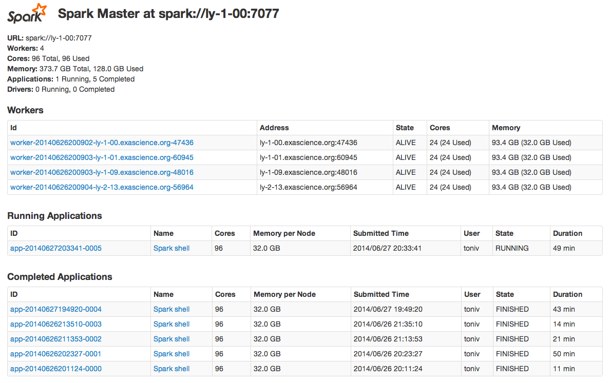

- - -

## ... and distributed memory caching

\ 

```scala
val file = textFile("Joyce-Ulysses.txt")
val words = file.flatMap(_.split(" "))
val mapped = words map (word => (word,1))
// Cache the RDD for later use
val cached = mapped cache()
// Use the cached version
val result = cached reduceByKey(_+_)
// Oops, nothing happens?
result.collect
// Laziness... oh my
result.collect
```

<!-- So yes, caching works... but also: highly interactive! -->

- - -

## ... and interactive use

- - -

## ... and the Ecosystem

\ 

- [Spark SQL](http://spark.apache.org/sql/)
- [Spark Streaming](http://spark.apache.org/streaming/)
- [BlinkDB](http://blinkdb.org/)
- [MLlib](http://spark.apache.org/mllib/)
- [GraphX](http://spark.apache.org/graphx/)

<!--  ... and predicting Germany - Brasil

\ 

```scala
val data = textFile("WorlCupData.dat")
val parsedData = data.map(x => parse(x)).cache()
val model = trainModel(parsedData)
val predict = model("Germany","Brasil")
predict.score
// ... Buffer overflow ...
```
-->


# Not covered

- - -

## Better?

## Faster?

## Easier?

## ...

- - -

## RDDs Under the Hood

\ 

<http://dl.acm.org/citation.cfm?id=2228301>

\ 


- - -

## Configuration & Performance

\ 

<https://spark.apache.org/docs/latest/configuration.html>

<https://spark.apache.org/docs/latest/tuning.html>

\ 

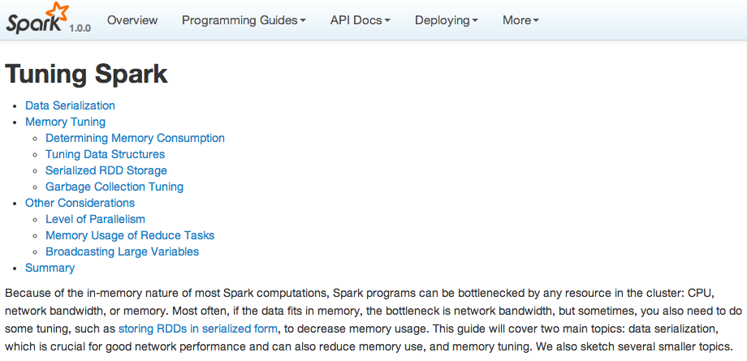


- - -

## Installation & Deployment

\ 

<https://spark.apache.org/docs/latest/cluster-overview.html>

\ 

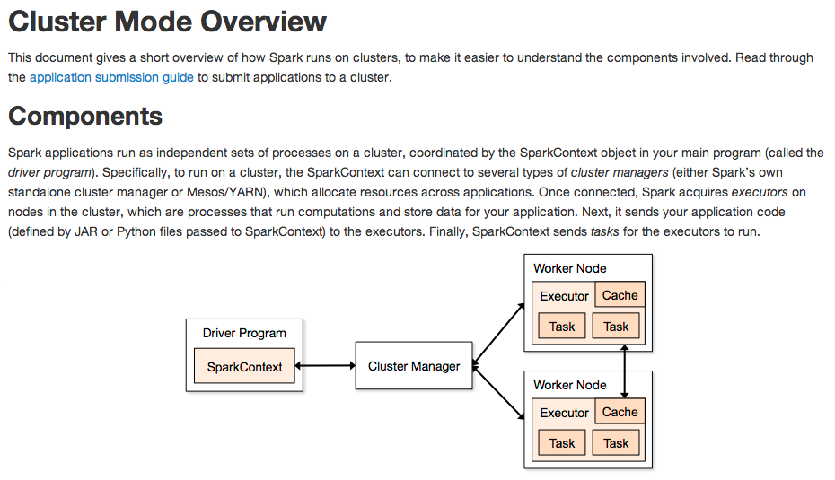

- - -

# Example(s)

- - -

## Genomic Data

<!-- Terrabytes of data roll out of sequencing machines daily. What are we going to do with all this data? -->

- - -

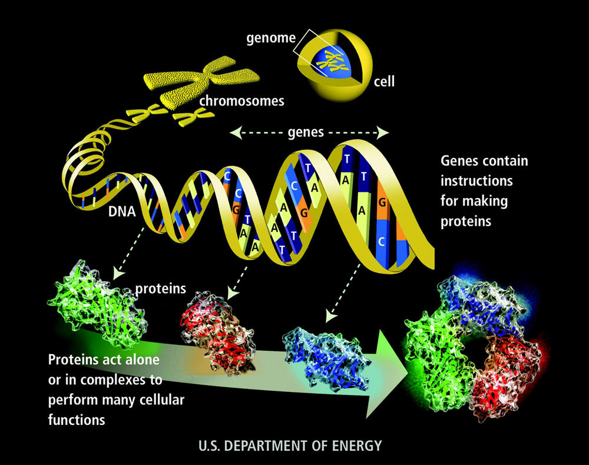

- - -

3 billion base pairs (3.2 x 10^9)

Packaged in chromosomes

~ 3GB for one human

\ 

Analysis requires a lot of processing power and storage

\ 

**Transcription Factors**: bind to DNA at certain location
**Coverage**: basepair occurence in sequencing

- - -

Coverage data:

\ 

```
Chromosome   Position    Sequencing coverage
19           11004       1
19           11005       2
19           11006       2
19           11007       2
19           11008       3
19           11009       3
```

- - -

Transcription Factor data:

\ 

```bash
> awk 'BEGIN {srand()} !/^$/ { if (rand() <= .00001) print $0}' bedfile.bed

chr1    70529738    70529754    Maf     .   -
chr1    161676477   161676495   Pou2f2  .   -
chr1    176484690   176484699   AP-1    .   -
chr10   6020071     6020084     CTCF    .   -
chr11   1410823     1410838     NF-Y    .   -
chr16   4366053     4366067     YY1     .   +
chr17   77824593    77824602    BAF155  .   +
chr19   10947006    10947013    Rad21   .   -
chr19   49342112    49342121    SIX5    .   +
chr22   39548908    39548922    Irf     .   +
chr7    100048475   100048485   Egr-1   .   -
chr8    119123364   119123374   YY1     .   +
chr8    128562635   128562649   p300    .   -
chr9    14315969    14315982    Egr-1   .   -
chrX    101409366   101409384   CTCF    .   +
```


- - -

```scala
// Load files from HDFS
val covFile = sc.textFile("NA12878.chrom19.SLX.maq.SRP000032.2009_07.coverage",8)
val bedFile = sc.textFile("201101_encode_motifs_in_tf_peaks.bed",8)

// Class to hold records from coverage data
class covData(val chr: String, val pos: Int, val cov: Int) {
    def this(line: Array[String]) {
     this(line(0).toString, line(1).toInt, line(2).toInt)
    }
}

// Class to hold records from Transcription Factor data
class tfsData(val chr: String, val pos1: Int, val pos2:Int, val tf: String) {
    def this(line: Array[String]) {
     this(line(0).toString, line(1).toInt, line(2).toInt, line(3).toString)
    }
}
```

- - -

```scala
// Turn input files into an RDD of objects
val cov = covFile.map(_.split("\\s+")).map(new covData(_))
val tfs = bedFile.map(_.split("\\s+")).map(new tfsData(_))

// Count the number of items in both datasets
cov.count
tfs.count

// Cache in memory
val ccov = cov cache
val ctfs = tfs cache

// Count once for the caching to occur
ccov.count
ctfs.count
```

- - -

```scala
// Turn coverage data into K/V pairs
val kvcov = ccov.map(x => (x.pos,(x.cov))).cache
// Turn TF data into K/V pairs
val kvtfs = ctfs.filter(x => x.chr == "chr19").map(x => (x.pos1,(x.pos2,x.tf)))

// Activate the caching of the coverage data
kvcov.count

// Join both datasets together by key
val cjoined = kvcov.join(kvtfs)

// Waaaw, that's fast! In fact, nothing happened yet.
// select 5 entries to see the result but reformat first
val flatjoined = cjoined map { case(x,(y,(z,zz))) => (x,z,zz,y) }
flatjoined take 5
```

- - -

## Visualization of genomic data

<!-- This is really the reason we invest in Spark -->

- - -

### Visual Analytics


- - -

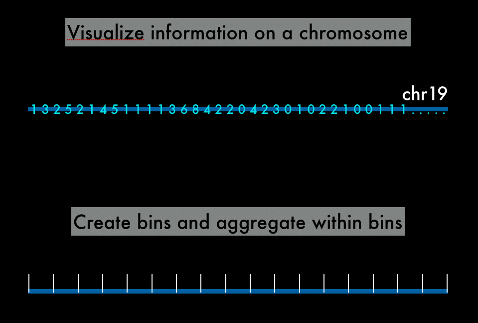

- - -

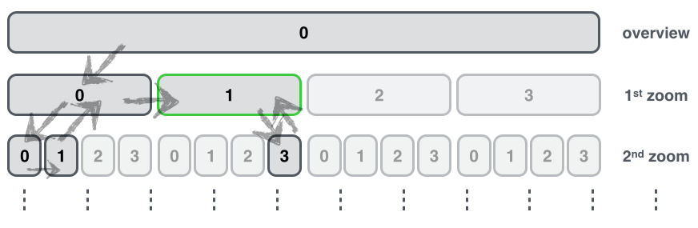

- - -

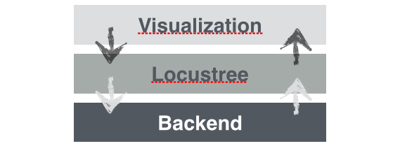

- - -

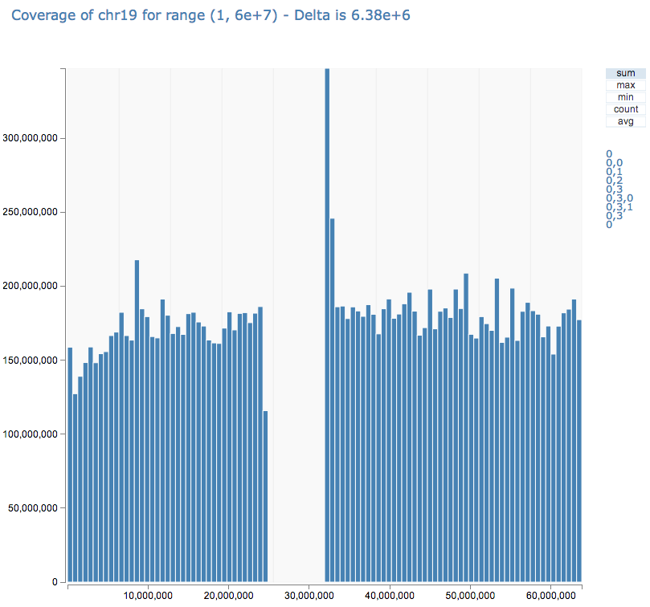

- - -


- - -

Part of `treeDraw` :

```javascript
  d3.select(window).on("keydown", function() {
    d3.event.preventDefault();
    switch (d3.event.keyCode) {
      case 38: 
        zoomOut(tz,treeDraw);
        break ;
      case 40:
        zoomIn(0,tz,treeDraw);
        break;
      case 37: 
        panLeft(tz,treeDraw);
        break;
      case 39: 
        panRight(tz,treeDraw);
        break; 
    };
  });
```

- - -

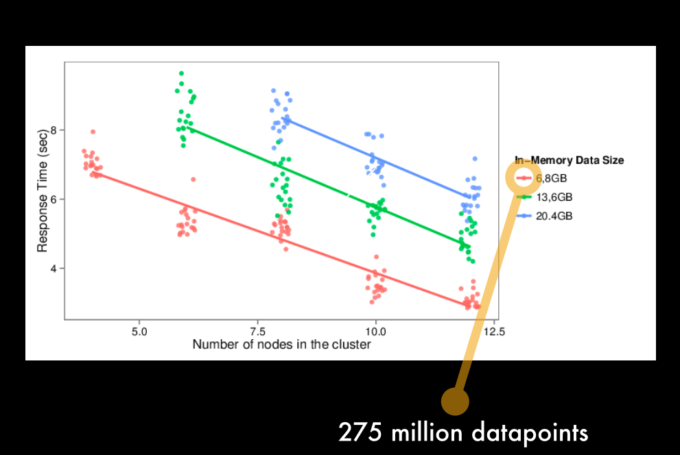

- - -

# The end

\ 

Some links:

- Slides: <https://github.com/tverbeiren/BigDataBe-Spark>
- [Spark Home](https://spark.apache.org/)
- [Data Visualization Lab](http://datavislab.org)
- [ExaScience Life Lab](http://www.exascience.com/)
- [Data Intuitive](http://data-intuitive.com)


- - -

- - -

# Reference material and style info...

- - -

<style>
#barchart svg {
    overflow: hidden;
}

.node rect {
    stroke: #333;
    stroke-width: 1.5px;
    fill: #fff;
}

text {
  font-weight: 300;
  font-size: 20px;
}

.edgeLabel rect {
    fill: none;
    min-width: 60px;
}

.edgePath {
    stroke: #333;
    stroke-width: 1.5px;
    fill: none;
}
</style>


- - -

```bash
tmux
isub -n 2
module load hadoop-2.3.0
module load spark-0.9.0-hadoop-2.3.0

hadoop fs -mkdir /user
hadoop fs -mkdir /user/toniv 
hadoop fs -copyFromLocal data/NA12878.chrom19.SLX.maq.SRP000032.2009_07.coverage /user/toniv/
hadoop fs -copyFromLocal data/201101_encode_motifs_in_tf_peaks.bed /user/toniv/
hadoop fs -copyFromLocal data/Joyce-Ulysses.txt /user/toniv/
hadoop fs -copyFromLocal data/lpsa.data /user/toniv/
hdfs dfs -setrep -w 3 /user/toniv
# Start the Spark Shell
SPARK_MEM=32g MASTER=spark://ly-1-10:7077 bin/spark-shell
```

- - -

```bash
cd server
cat local.conf | sed '/^\ *master/ c\  master = "'"$MASTER"\"> local.tmp
cp local.conf local.backup
cp local.tmp local.conf
./server_start.sh
cd ~
```

- - -

```bash
export HOST=ly-1-00
curl --data-binary @job-server-tests/target/job-server-tests-0.3.0.jar  $HOST:8090/jars/Cov
curl -d '' "http://$HOST:8090/contexts/my_context?memory-per-node=16g&num-cpu-cores=32"
curl -d 'partitions = 8, filename = "hdfs://'$HOST':54310/user/toniv/NA12878.chrom19.SLX.maq.SRP000032.2009_07.coverage"' "http://$HOST:8090/jobs?appName=Cov&classPath=spark.jobserver.Cov&context=my_context"
```

- - -

```scala
val file = textFile("/var/log/system.log")
val words = file.flatMap(_.split(" "))
val mapped = words map (x => (x,1))
val grouped = mapped.groupBy(_._1)
val res = grouped map (x => x._2.length)
```


- - -

### Lineage

<div id="simpleLineage" align="center">
<svg width="600" height="500">
<g transform="translate(20,20)"/>
</svg>
</div>

<script>
Reveal.addEventListener( 'ready', function( event ) {
    // event.currentSlide, event.indexh, event.indexv
    // Create a new directed graph
    var g = new dagreD3.Digraph();

    g.addNode("a1", { label: "file" });
    g.addNode("a2", { label: "words" });
    g.addNode("a3", { label: "mapped" });
    g.addNode("a4", { label: "grouped" });
    g.addNode("a5", { label: "result" });

    g.addEdge(null, "a1", "a2", { label: "flatMap" });
    g.addEdge(null, "a2", "a3", { label: "map / sort" });
    g.addEdge(null, "a3", "a4", { label: "groupByKey" });
    g.addEdge(null, "a4", "a5", { label: "reducyByKey" });
    
    var renderer = new dagreD3.Renderer();
    renderer.edgeInterpolate('linear');
    var svgElement = d3.selectAll("#simpleLineage svg g");
    var layout = dagreD3.layout()
//                        .nodeSep(20)
//                        .rankDir("LR");
    renderer.layout(layout).run(g, svgElement);
} );
</script>


