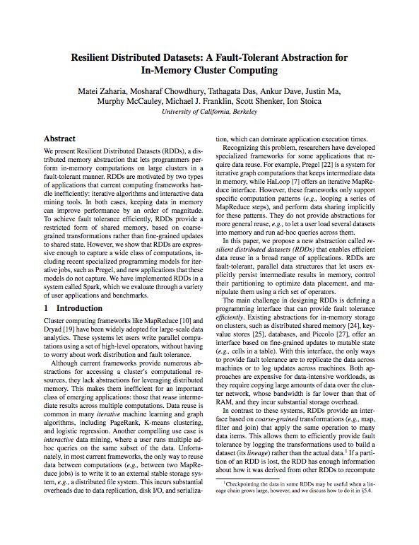

% Spark
% T. Verbeiren
% 9/7/2014


# Contents

Introduction

Spark

Ecosystem

Not covered

Example(s)

- - -

# Me, Myself and I

- - -


- - -

# Introduction

- - -

## Distribution is hard ...

\ 

2 world views:

\ 

- **H**igh **P**erformance **C**omputing
- **H**igh **T**hroughput **C**omputing

- - - 

## Map / Reduce

\ 

### `map`

\ 

### `reduce`

\ 

(Nothing special ?!)

- - -

## Word Count in M/R

- - -


- - -

```java
import java.io.IOException;
import java.util.*;
        
import org.apache.hadoop.fs.Path;
import org.apache.hadoop.conf.*;
import org.apache.hadoop.io.*;
import org.apache.hadoop.mapreduce.*;
import org.apache.hadoop.mapreduce.lib.input.FileInputFormat;
import org.apache.hadoop.mapreduce.lib.input.TextInputFormat;
import org.apache.hadoop.mapreduce.lib.output.FileOutputFormat;
import org.apache.hadoop.mapreduce.lib.output.TextOutputFormat;

public class WordCount {
        
    public static void main(String[] args) throws Exception {
        Configuration conf = new Configuration();
            
        Job job = new Job(conf, "wordcount");
        
        job.setOutputKeyClass(Text.class);
        job.setOutputValueClass(IntWritable.class);
            
        job.setMapperClass(Map.class);
        job.setReducerClass(Reduce.class);
            
        job.setInputFormatClass(TextInputFormat.class);
        job.setOutputFormatClass(TextOutputFormat.class);
            
        FileInputFormat.addInputPath(job, new Path(args[0]));
        FileOutputFormat.setOutputPath(job, new Path(args[1]));
            
        job.waitForCompletion(true);
     }  

     public static class Map extends Mapper<LongWritable, Text, Text, IntWritable> {
        private final static IntWritable one = new IntWritable(1);
        private Text word = new Text();
            
        public void map(LongWritable key, Text value, Context context) throws IOException, InterruptedException {
            String line = value.toString();
            StringTokenizer tokenizer = new StringTokenizer(line);
            while (tokenizer.hasMoreTokens()) {
                word.set(tokenizer.nextToken());
                context.write(word, one);
            }
        }
     } 

     public static class Reduce extends Reducer<Text, IntWritable, Text, IntWritable> {

        public void reduce(Text key, Iterable<IntWritable> values, Context context) 
          throws IOException, InterruptedException {
            int sum = 0;
            for (IntWritable val : values) {
                sum += val.get();
            }
            context.write(key, new IntWritable(sum));
        }
     }
}
```

- - -

## What if ...

- - - 

### ... we could just write

\ 

```scala
val y = x map () reduce ()
```

- - -

### ... this could be extended

\ 

```scala
val y = x map () filter() map () flatMap () reduce ()
```

- - -

## What would be needed?

\ 

1. Platform

<!-- Fast and efficient resource management -->

\ 

2. Parallel abstraction mechanism

<!-- Some kind of abstraction that allows us to deal with what instead of how -->

\ 

3. Language support

<!-- Functions as first-class citizens -->

\ 


- - -

# Spark

- - -

\ 


\ 

- Berkeley University
- Apache Project
- v1.0 released on May 30d 2014
- Written in Scala
- Supported by [DataBricks](http://databricks.com/)
- Used by ...

- - -

## Language support

\


- - -

## Platform

\ 

Built for low-latency

- - -

## Abststraction mechanism

\ 

**R**esilient **D**istributed **D**atasets

- - -

### RDDs

\ 

*Immutable* Collection

\ 

Accepting **transformations** and **actions**

- - -

### Transformations

\ 

- `map`
- `filter`
- `sample`
- `union` / `intersection`
- `groupByKey`
- `reduceByKey`
- `join`
- ...

- - -

### Actions

\ 

- `reduce`
- `collect`
- `count`
- `take(n)`
- `saveAsTextFile`
- ...

- - -

### The first example

\ 

<svg width="400" height="400">
  <rect width="400" height="400" style="fill:rgb(0,0,0);stroke-width:0;stroke:rgb(0,0,0)" />
  <circle cx="200" cy="200" r="200" stroke="black" stroke-width="0" fill="yellow" />
  <line x1="200" y1="200" x2="360" y2="80" style="stroke:rgb(0,0,0);stroke-width:4" />
  <text x="240" y="80" fill="black">r = 1/2</text>
</svg>

\ 

$$\text{P}(\text{hitting circle}) \approx
\text{Surface circle} = \frac{\pi}{4}$$

- - -

```scala
import sc._

val N = 10000000

// Generate a sequence of numbers and distribute
val par = parallelize(1 to N)

// Generate a point in 2D unit square
def randomPoint:(Double,Double) = {
    val x = Math.random()
    val y = Math.random()
    (x,y)
}
// Check if a point lies in the unit circle
def inCircle(point:(Double,Double)):Int = {
    if (point._1*point._1 + point._2*point._2 < 1) 1 else 0
}
```

- - -

```scala
// List of hits yes/no
val inCircleList = par map(i => inCircle(randomPoint))

// Return the first 5 elements from the RDD
inCircleList take 5

// Get info about the RDD
inCircleList.toDebugString

// The number of hits
val total = inCircleList reduce (_+_)

// Probability of hitting the circle *4 = Pi
val S = 4. * total / N
```

- - -

From the [Spark examples](https://spark.apache.org/examples.html) page

\

```scala
val count = parallelize(1 to N).map{i =>
  val x = Math.random()
  val y = Math.random()
  if (x*x + y*y < 1) 1 else 0
}.reduce(_ + _)
println("Pi is roughly " + 4.0 * count / N)
```

- - -

Hadoop M/R in Spark

\ 

```scala
// Read a file from Hadoop FS, (e.g. Ulysses / Project Gutenberg)
// and process it similar to Hadoop M/R
val file = textFile("Joyce-Ulysses.txt")

// Convert to an array of words in the text
val words = file.flatMap(_.split(" "))

// Map to (key,value) pairs
val mapped = words map (word => (word,1))

// Sort and group by key, 
// Result is of form (key, List(value1, value2, value3, ...))
val grouped = mapped sortByKey() groupByKey()

// The length of the values array yields the amount
val result = grouped map {case (k,vs) => (k,vs.length)}
// But where is the *reduce*?
```

- - -

Be careful with _definitions_ of `map` and `reduce`!

\ 

```scala
// Read a file from Hadoop FS, (e.g. Ulysses / Project Gutenberg)
// and process it similar to Hadoop M/R
val file = textFile("Joyce-Ulysses.txt")

// Convert to an array of words in the text
val words = file.flatMap(_.split(" "))

// Map to (key,value) pairs
val mapped = words map (word => (word,1)) 

// Sort and group by key, 
// Result is of form (key, List(value1, value2, value3, ...))
val grouped = mapped sortByKey() groupByKey()

// The length of the values array yields the amount
// val result = grouped map {case (k,vs) => (k,vs.length)}
val result = grouped map {case (k,vs) => (k, vs reduce (_+_))}
```

- - - 

In Spark, we would use:

\ 

```scala
val file = textFile("Joyce-Ulysses.txt")
val words = file.flatMap(_.split(" "))
val mapped = words map (word => (word,1))
val result = mapped reduceByKey(_+_)
result collect
```

- - -

## ... and REPL

- - -

## ... and Web interface

- - -


- - -

## ... and distributed memory caching

\ 

```scala
val file = textFile("Joyce-Ulysses.txt")
val words = file.flatMap(_.split(" "))
val mapped = words map (word => (word,1))
// Cache the RDD for later use
val cached = mapped cache()
// Use the cached version
val result = cached reduceByKey(_+_)
// Oops, nothing happens?
result.collect
// Laziness... oh my
result.collect

// Count how many times the word 'the' occurs in the text
cached filter {case(word,v) => word=="the"} reduceByKey(_+_) collect
```

<!-- So yes, caching works... but also: highly interactive! -->

- - -

## ... and interactive use

- - -

## ... and the Ecosystem

\ 

- Spark SQL: <http://spark.apache.org/sql/>
- Spark Streaming: <http://spark.apache.org/streaming/>
- BlinkDB: <http://blinkdb.org/>
- MLlib: <http://spark.apache.org/mllib/>
- GraphX: <http://spark.apache.org/graphx/>
- SparkR: <http://amplab-extras.github.io/SparkR-pkg/>


# Not covered

- - -

## Better ?

## Faster ?

## Easier ?

## ...

- - -

## RDDs Under the Hood

\ 

<http://dl.acm.org/citation.cfm?id=2228301>

\ 



- - -

## Configuration & Performance

\ 

<https://spark.apache.org/docs/latest/configuration.html>

<https://spark.apache.org/docs/latest/tuning.html>

\ 


- - -

## Installation & Deployment

\ 

<https://spark.apache.org/docs/latest/cluster-overview.html>

\ 


- - -

# Example(s)

- - -

## Genomic Data

<!-- Terrabytes of data roll out of sequencing machines daily. What are we going to do with all this data? -->

- - -


- - -

<!-- Human DNA consists of around 3 billion base-pairs. this amounts to approximately 3GB of hard drive storage. This is not too much. The complexity of DNA analysis is due to something else: 

1. The machines that read the DNA usually do not do that in an orderly fashion
2. They make a lot of errors when reading base-pairs
3. In order to cope with the errors, multiple copies of the DNA are read

A whole pipeline is then executed in order to reconstruct the original DNA.

Below, we deal with 2 types of information about DNA: coverage information and transcription factors.
 -->

3 billion base pairs ($3.2 \times 10^9$)

Packaged in chromosomes

~ 3GB for one human

\ 

Analysis requires a lot of processing power and storage

\ 

**Transcription Factors**: proteins that bind on region

**Coverage**: basepair occurence in sequencing

- - -

Coverage data:

\ 

```
Chromosome   Position    Sequencing coverage
19           11004       1
19           11005       2
19           11006       2
19           11007       2
19           11008       3
19           11009       3
```

- - -

Transcription Factor data:

\ 

```bash
> awk 'BEGIN {srand()} !/^$/ { if (rand() <= .00001) print $0}' bedfile.bed

chr1    70529738    70529754    Maf     .   -
chr1    161676477   161676495   Pou2f2  .   -
chr1    176484690   176484699   AP-1    .   -
chr10   6020071     6020084     CTCF    .   -
chr11   1410823     1410838     NF-Y    .   -
chr16   4366053     4366067     YY1     .   +
chr17   77824593    77824602    BAF155  .   +
chr19   10947006    10947013    Rad21   .   -
chr19   49342112    49342121    SIX5    .   +
chr22   39548908    39548922    Irf     .   +
chr7    100048475   100048485   Egr-1   .   -
chr8    119123364   119123374   YY1     .   +
chr8    128562635   128562649   p300    .   -
chr9    14315969    14315982    Egr-1   .   -
chrX    101409366   101409384   CTCF    .   +
```

- - -

```scala
// Load files from HDFS
val covFile = sc.textFile("NA12878.chrom19.SLX.maq.SRP000032.2009_07.coverage",8)
val bedFile = sc.textFile("201101_encode_motifs_in_tf_peaks.bed",8)

// Class to hold records from coverage data
class covData(val chr: String, val pos: Int, val cov: Int) {
    def this(line: Array[String]) {
     this(line(0).toString, line(1).toInt, line(2).toInt)
    }
}

// Class to hold records from Transcription Factor data
class tfsData(val chr: String, val pos1: Int, val pos2:Int, val tf: String) {
    def this(line: Array[String]) {
     this(line(0).toString, line(1).toInt, line(2).toInt, line(3).toString)
    }
}
```

- - -

```scala
// Turn input files into an RDD of objects
val cov = covFile.map(_.split("\\s+")).map(new covData(_))
val tfs = bedFile.map(_.split("\\s+")).map(new tfsData(_))

// Count the number of items in both datasets
cov.count
tfs.count

// Cache in memory
val ccov = cov cache
val ctfs = tfs cache

// Count once for the caching to occur
ccov.count
ctfs.count
```

- - -

```scala
// Turn coverage data into K/V pairs
val kvcov = ccov.map(x => (x.pos,(x.cov))).cache
// Turn TF data into K/V pairs
val kvtfs = ctfs.filter(x => x.chr == "chr19").map(x => (x.pos1,(x.pos2,x.tf)))

// Activate the caching of the coverage data
kvcov.count

// Join both datasets together by key
val cjoined = kvcov.join(kvtfs)

// Waaaw, that's fast! In fact, nothing happened yet.
// select 5 entries to see the result but reformat first
val flatjoined = cjoined map { case(x,(y,(z,zz))) => (x,z,zz,y) }
flatjoined take 5

flatjoined.toDebugString
```

- - -

## Visualization of Big Data

<!-- This is really the reason we invest in Spark -->

- - -

### Visual Analytics


- - -


- - -


- - -


- - -


- - -


- - -

Part of `treeDraw` :

```javascript
  d3.select(window).on("keydown", function() {
    d3.event.preventDefault();
    switch (d3.event.keyCode) {
      case 38: 
        zoomOut(tz,treeDraw);
        break ;
      case 40:
        zoomIn(0,tz,treeDraw);
        break;
      case 37: 
        panLeft(tz,treeDraw);
        break;
      case 39: 
        panRight(tz,treeDraw);
        break; 
    };
  });
```

- - -

```scala
object CovQuery extends SparkJob with NamedRddSupport {

  type Range = (Int, Int)
  type TreePath = List[Int]

  val B = 100     // number of bins, also N
  val Z = 10      // zoom level with every step

  override def validate(sc: SparkContext, config: Config): SparkJobValidation = SparkJobValid

  override def runJob(sc: SparkContext, config: Config): Any = {

    // a map with the persistent RDDs
    val listOfPersistentRDDs = sc.getPersistentRDDs

    val chrCache = namedRdds.get[DataPoint](myRDD).get

    // Info about the interval
    val superMin = low
    val superMax = high

    val subRange: Range = calcRange(path,superMin,superMax)
    val mn = subRange._1
    val mx = subRange._2

    // The bin width, based on the number of bins (N)
    val delta = (mx - mn) / B

    // Only filter the region within the interval
    val chrCache1 = chrCache filter (x => (mn <= x.position) && (x.position <= mx))

    // Create the bins as the first argument of a new triple
    val x1 = chrCache1 map (x => (myDiv(x.position - mn, delta), x.position, x.coverage))

    // sum, max and min can be done on only the bin number and the coverage:
    val fork1 = x1.map(x => (x._1,x._3))

    // The 4 statistics
    val sumSet = fork1.reduceByKey(_ + _)
    val maxSet = fork1.reduceByKey(Math.max(_,_))
    val minSet = fork1.reduceByKey(Math.min(_,_))
    val countSet = x1.map(x => (x._1,1)).reduceByKey(_+_)

    // Join the data and flatten the (nested) result
    val joined = sumSet.join(maxSet).join(minSet).join(countSet)
    val collected = joined.collect().map(x => (x._1, flattenT3(x._2)))

    // The boundaries in the original coordinate can not be derived
    // from the data, because it can not cope with empty regions.
    val lowerboundRange = mn until mx by delta
    val lowerboundIndex = 0 until B
    val lowerbound = lowerboundIndex zip lowerboundRange

    val dataMap =collected.map(x=> (x._1,List(x._2._1,x._2._2,x._2._3,x._2._4,x._2._1/x._2._4))).toMap.withDefaultValue(List(0,0,0,0,0))

    return lowerbound.map(x => (x._1,List(x._2) ++ dataMap(x._1)))

  }
```

- - -


- - -

Paper submitted to LDAV 2014

\ 


- - -

# The end

\ 

Some links:

- @tverbeiren
- Slides: <https://github.com/tverbeiren/BigDataBe-Spark>
- Spark Home: <https://spark.apache.org/>
- Data Visualization Lab: <http://datavislab.org>
- ExaScience Life Lab: <http://www.exascience.com/>
- Data Intuitive: <http://data-intuitive.com>

